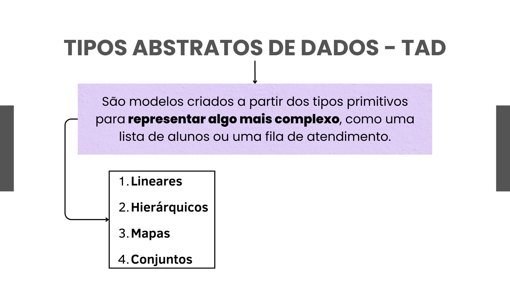

# Tipos Abstratos de Dados (TAD)
Os TADs são modelos estruturados para armazenar e manipular dados, sem se preocupar com detalhes da implementação.



## (A) Estruturas Lineares
Os elementos são organizados em sequência:

Listas → Coleção ordenada de elementos.
Filas (Queue) → FIFO (First In, First Out).
Pilhas (Stack) → LIFO (Last In, First Out).


## (B) Estruturas Hierárquicas
Os elementos têm relações de pai-filho:

Árvores → Estruturas onde cada nó pode ter múltiplos filhos.
Grafos → Conjuntos de nós conectados por arestas.


##  Mapas (Dicionários, Tabelas de Espalhamento)
São coleções de pares chave-valor.
Exemplos:
dict em Python:

```python
dados = {"nome": "Carlos", "idade": 30}
print(dados["nome"])  # Carlos
```

Map em JavaScript:
```js

let dados = new Map();
dados.set("nome", "Carlos");
console.log(dados.get("nome")); // Carlos
```


# (D) Conjuntos
Armazenam elementos únicos, sem duplicatas.
Exemplo em Python:

```python
conjunto = {1, 2, 3, 4, 4}  # {1, 2, 3, 4}
```

