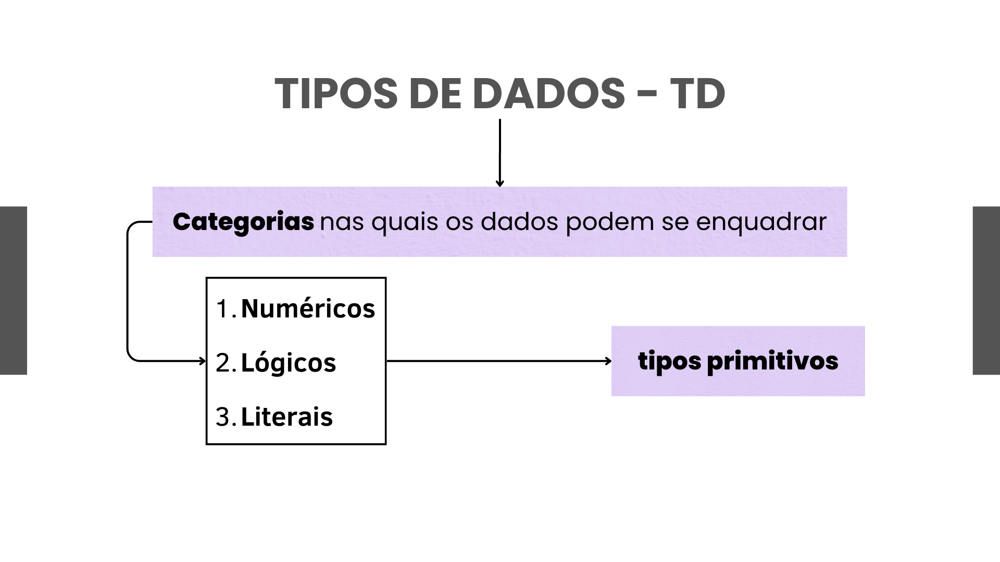
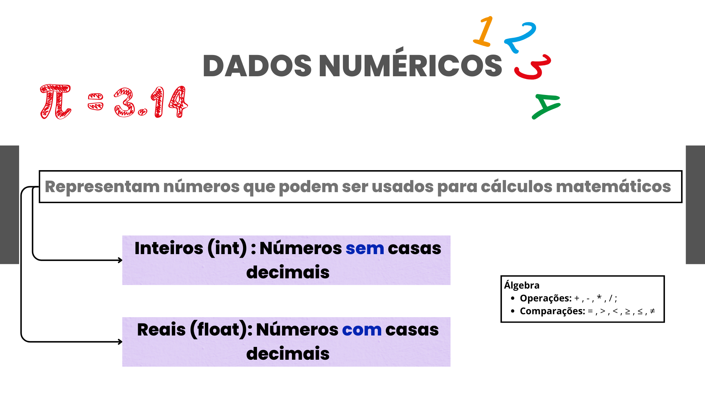
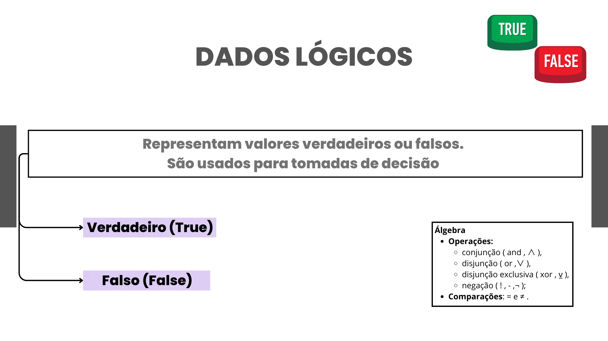
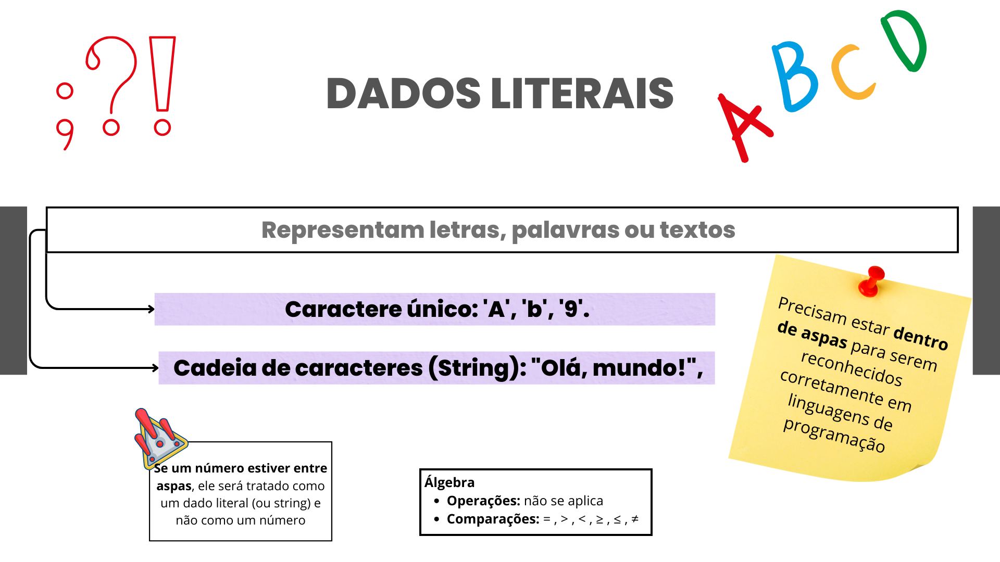

# Tipos de Dados Primitivos
Os tipos primitivos são aqueles fornecidos pela linguagem de programação para armazenar valores simples.



## Numéricos
Armazenam números e podem ser inteiros ou de ponto flutuante:

### Inteiros:

int (C, Java, Python) → Exemplo: int idade = 25;
short, long (C, Java) → Definem tamanhos diferentes de inteiros.
byte (Java) → Para valores pequenos (-128 a 127).


### Ponto Flutuante:

float, double (C, Java, Python) → Para números com casas decimais.
Exemplo: double salario = 2500.75;




### Lógicos (Booleanos)
Armazenam apenas dois valores:

true (verdadeiro) e false (falso).
Em C: int x = 1; (true) e int y = 0; (false).
Em Python: bool ativo = True.
Em JavaScript: let ligado = false;.



### Literais (Textuais ou Caracteres)
Armazenam textos ou caracteres únicos:

char → Um único caractere. Exemplo: char letra = 'A';
string → Conjunto de caracteres. Exemplo: string nome = "Carlos";
Em C, strings são arrays de char:

```c
char nome[] = "Carlos";
```` 

